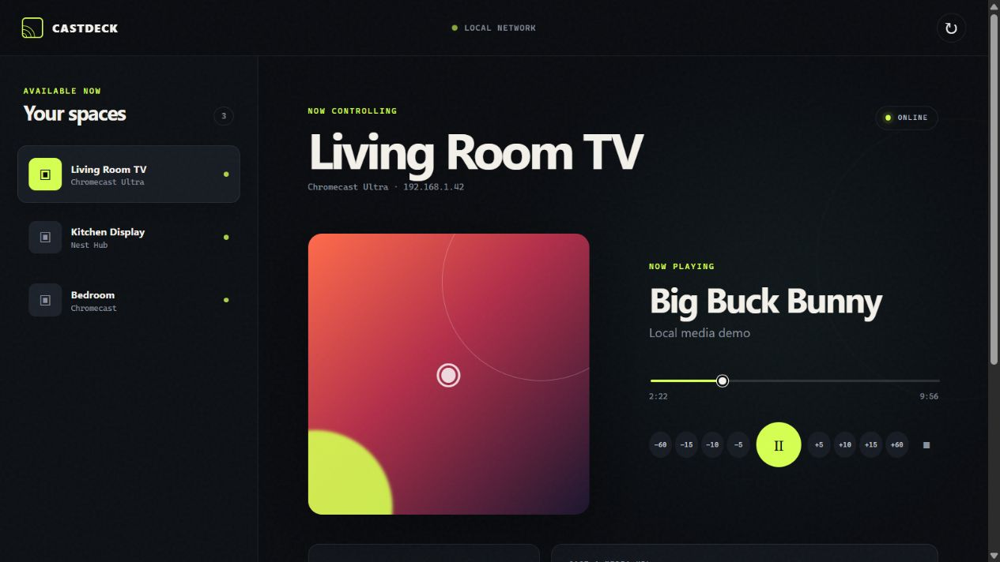
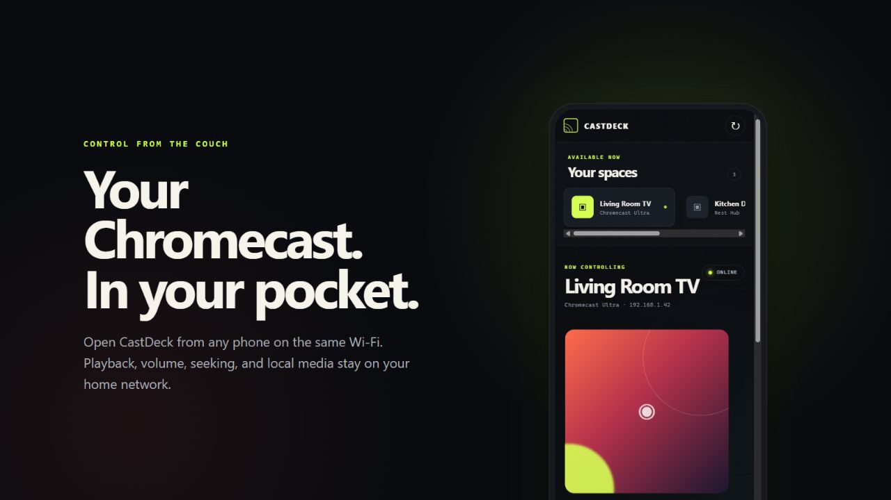

# CastDeck

**A private, phone-friendly remote for Chromecast and Google Cast devices on your local network.**

Discover receivers, see what is playing, control playback and volume, stack quick-seek commands, cast direct media URLs, and serve downloaded media from the host computer—without a cloud account.



## Highlights

- Automatic Chromecast and Google Cast discovery
- Live title, artwork, playback position, player state, and receiver volume
- Play, pause, stop, mute, seek, and volume controls
- Stackable `−60`, `−15`, `−10`, `−5`, `+5`, `+10`, `+15`, and `+60` second skips
- Direct casting for compatible HTTP(S) media URLs
- Local file serving with byte-range support for seeking
- Phone-ready interface available to devices on the same Wi-Fi
- Server-sent status updates, a live in-browser timer, and recovery polling
- Self-contained demo mode that never contacts a real Chromecast

## Phone control



CastDeck runs on the computer and opens its controller to the local network. A phone on the same Wi-Fi uses the LAN address printed by the server; no phone app or account is required.

## Quick start on Windows

### One click

1. Install [Python 3.11 or newer](https://www.python.org/downloads/).
2. Double-click `start.bat`.
3. Leave the CastDeck terminal open.
4. On a phone connected to the same Wi-Fi, open the **Phone on Wi-Fi** URL shown in the terminal.

On first launch, the script creates `.venv`, installs the dependency, starts the server on port `4173`, and opens the local controller.

If Windows Firewall asks, allow Python on **private networks**. Your computer, phone, and Cast devices must be on the same LAN.

### Manual start

```powershell
python -m venv .venv
.venv\Scripts\python -m pip install -r requirements.txt
.venv\Scripts\python server.py --host 0.0.0.0 --port 4173
```

Then open:

- This computer: `http://127.0.0.1:4173`
- Phone or tablet: use the LAN URL printed in the terminal

The LAN address can change when your router assigns the computer a new IP, so the printed URL is the source of truth.

## Safe demo mode

Explore every screen and control with three simulated receivers:

```powershell
.venv\Scripts\python server.py --demo --port 4174
```

Open `http://127.0.0.1:4174`. Demo mode does not discover, connect to, or control devices on your network.

## Cast downloaded files

1. Copy supported files into the repository's `media` folder. Subfolders are supported.
2. Start CastDeck and select a receiver.
3. Under **Local media**, choose **Cast**. Use **Refresh** after adding a file.

The computer serves the file directly across the LAN to the Chromecast. It must remain powered on, connected, and running CastDeck for the duration of playback. Do not rename or move a file while it is playing.

Recognized file types include:

- Video: MP4, M4V, WebM, and HLS playlists
- Audio: MP3, M4A, AAC, WAV, FLAC, OGG, and Opus

A recognized container can still contain a codec that a particular Chromecast cannot decode. MP4 with H.264 video and AAC audio is the most broadly compatible choice.

Files downloaded on a phone are not uploaded automatically. Move them into the computer's `media` folder first; CastDeck then streams them from the computer to the receiver.

## Cast a media URL

Paste a direct, Chromecast-reachable HTTP(S) URL and choose its media type. MP4, HLS, MP3, and AAC options are included.

Webpage URLs—such as a video site's watch page—are not direct media URLs and do not work with the default Cast receiver. Likewise, `localhost` in a URL points back to the Chromecast itself, not the computer running CastDeck.

## How it works

```text
Phone or desktop browser
          │  HTTP + server-sent events
          ▼
   CastDeck Python server
      │              │
      │ Cast control │ Local media over HTTP
      ▼              ▼
 Chromecast / Google Cast receiver
```

The browser is only the interface. The local Python server handles discovery and Cast commands, publishes status changes to connected browsers, and serves files from `media` with range requests.

## Safety and privacy

- Opening CastDeck and discovering devices does not stop the current cast.
- Controls are sent only when you use them. The **Stop** control intentionally ends current playback.
- CastDeck is not published to the internet and does not require a cloud service.
- The controller has no login. Anyone on the same LAN can use it while the server is running.
- Do not port-forward `4173` or expose CastDeck directly to the public internet.
- Close the terminal window to stop serving the controller and local media.

## Troubleshooting

**No devices appear**

- Confirm the computer and Chromecast are on the same non-guest network.
- Disable client/AP isolation on the Wi-Fi network if it is enabled.
- Allow Python through Windows Firewall on private networks.
- Some VPNs block multicast discovery; temporarily disconnect the VPN or allow local-network traffic.

**The phone cannot open CastDeck**

- Use the **Phone on Wi-Fi** URL printed at startup, not `127.0.0.1`.
- Confirm the phone is on Wi-Fi rather than cellular data.
- Keep the terminal open and verify the firewall permission.

**A local file is listed but will not play**

- Try MP4/H.264/AAC to rule out codec support.
- Keep CastDeck running and make sure the receiver can reach the host computer.
- Avoid renaming, moving, or replacing the file during playback.

## Project layout

```text
castdeck/
├── public/
│   ├── app.js          # Browser controls and live status handling
│   ├── index.html      # Responsive controller interface
│   └── styles.css      # CastDeck visual design
├── docs/screenshots/   # README demo images
├── media/              # Local files available to cast
├── server.py           # HTTP server, Cast bridge, SSE, and media serving
├── requirements.txt    # Python dependency lock
└── start.bat           # Windows one-click launcher
```

## Dependency

CastDeck uses [PyChromecast](https://github.com/home-assistant-libs/pychromecast) for discovery and control. The browser UI has no npm build step and no frontend package dependencies.
